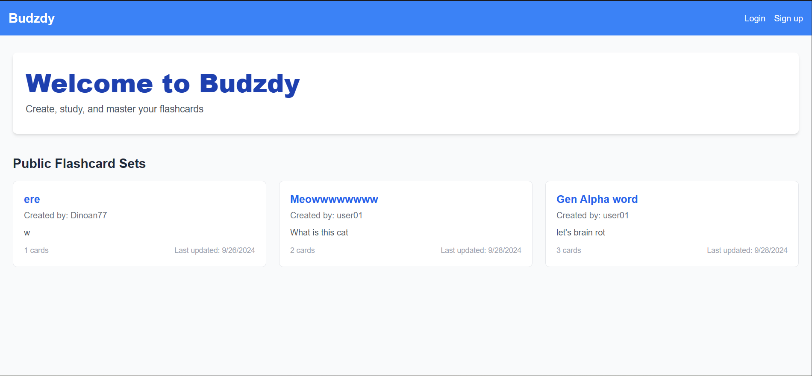
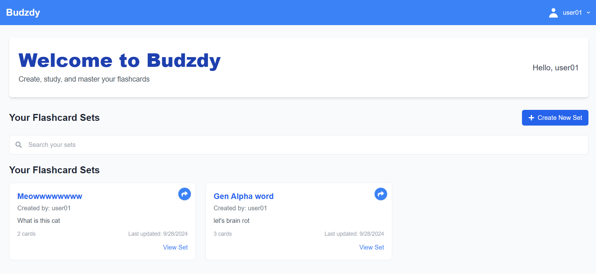
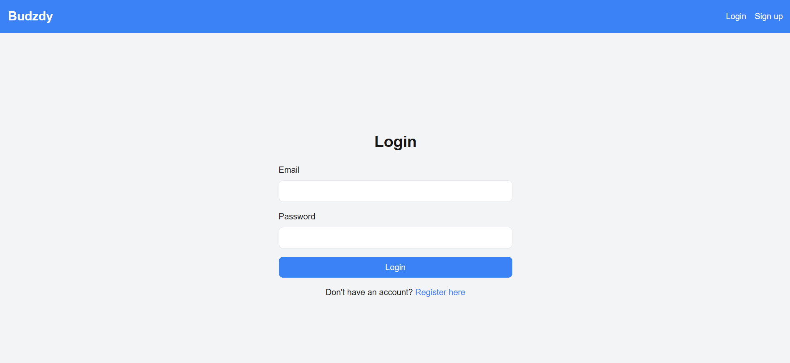
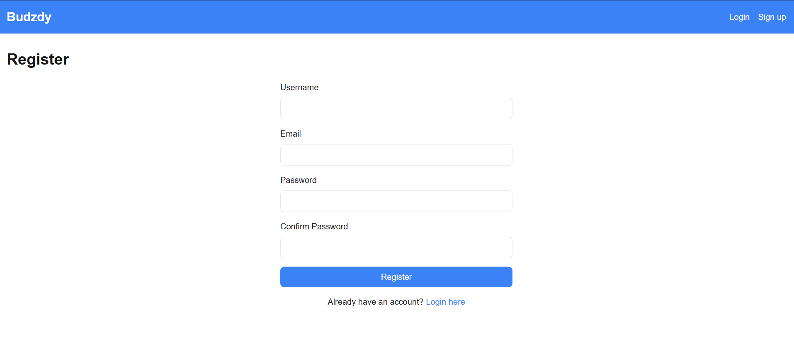
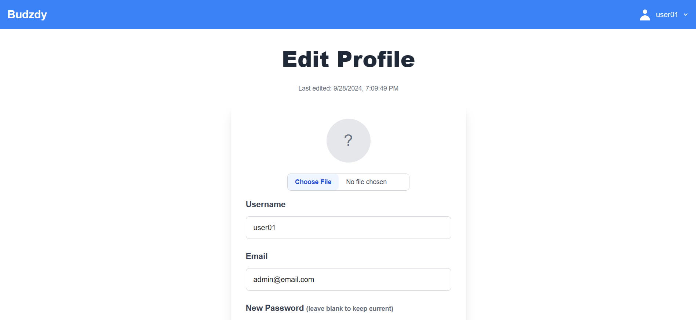
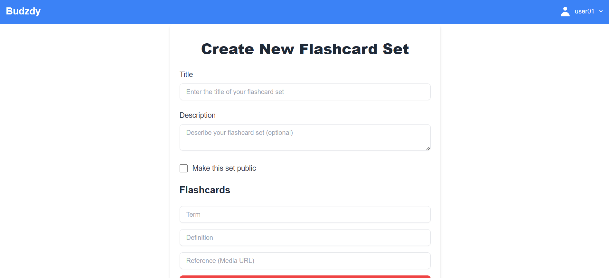
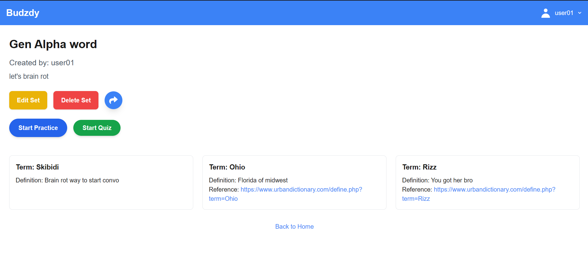
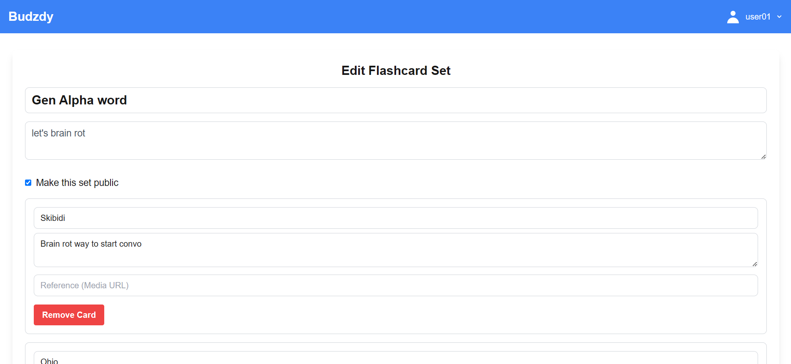
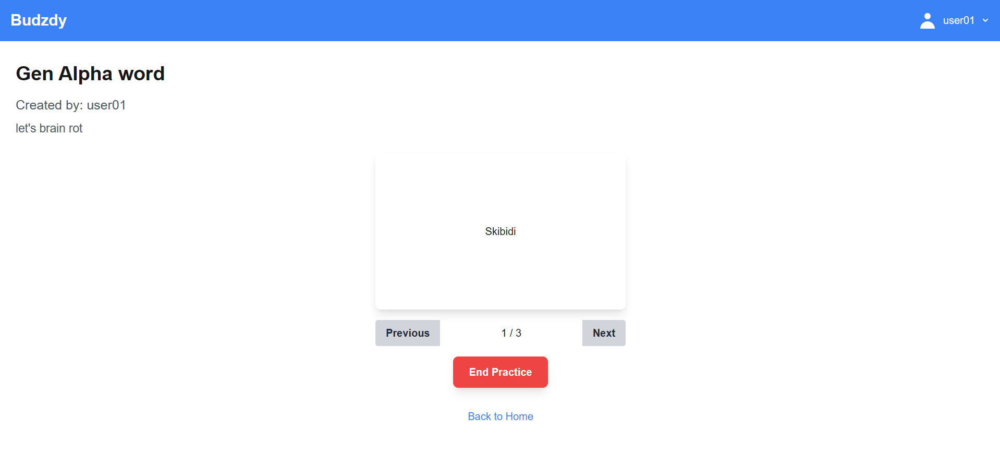
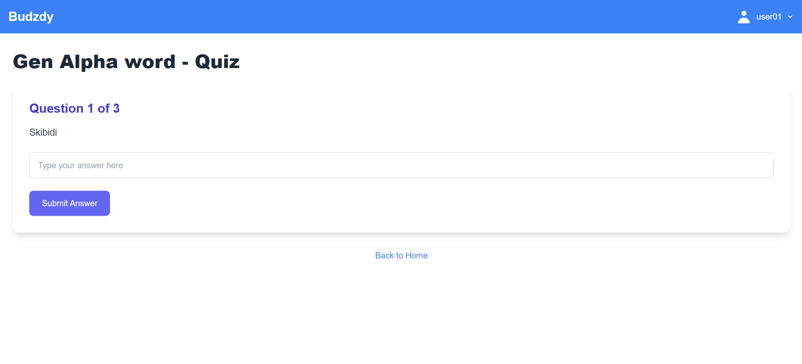

# Budzdy: Interactive Flashcard Learning Platform

## Project Overview

Budzdy is an interactive web application designed to help users create, study, and master flashcards which will help them to learn and memorize new information. This project was developed as part of a term project to demonstrate proficiency in modern web development technologies and practices.

Youtube Video: [Budzdy](https://www.youtube.com/watch?v=iGq_3xEFq9w)

## Screenshots

### home page no login



### home page login



### login page



### register page



### edit profile page

  

### create flashcard set page

  

### Flashcard set page

  

### edit flashcard set page

  

### Practice mode

  

### Quiz mode

  

## Features

- Allow users to create an account and login, edit profile, and delete account
  - CRUD operations for user model
    - Create - Register
    - Read - Login
    - Update - Edit Profile page
    - Delete - Delete Account button in Edit profile page
- Create and manage flashcard sets
  - CRUD operations for flashcard sets model
    - Create - Create New Flashcard Set
    - Read - View Flashcard Set
    - Update - Edit Flashcard Set
    - Delete - Delete Flashcard Set
  - CRUD operations for card model
    - Create - Add Card to Flashcard Set
    - Read - View Card in Flashcard set page
    - Update - Edit Card in Flashcard set page
    - Delete - Delete Card in Flashcard set page
- Study flashcards
  - Practice mode
    - Flip card
    - Next card
    - End practice
  - Quiz mode
    - Quiz
    - End quiz
- Search functionality for flashcard sets
- Share flashcard sets

## Technologies Used

- Next.js 13 (React framework)
- MongoDB (Database)
- Tailwind CSS (Styling)
- Next.js API Routes (Backend API)
- bcrypt (Password hashing)

## Installation and Setup

1. Clone the repository:

   ```bash
   git clone https://github.com/Nuthchapol-Rpch/mini-project-2.git
   ```

2. Install dependencies:

   ```bash
   cd mini-project-2
   pnpm install
   ```

3. Set up environment variables:
   Create a `.env.local` file in the root directory and add the following:

   ```.env
   MONGODB_URI=your_mongodb_connection_string
   ```

4. Run the development server:

   ```bash
   pnpm dev
   ```

5. Open [http://localhost:3000](http://localhost:3000) in your browser to see the application.

## Project Structure

```text
|-- app/
|   |-- api/
|   |   |-- card/
|   |   |-- flashcard-sets/
|   |   |   |-- [id]/
|   |   |-- register/
|   |   |-- users/
|   |
|   |-- context/
|   |   |-- UserContext.js
|   |
|   |-- create-set/
|   |-- edit-profile/
|   |-- flashcard-set/
|   |   |-- [id]/
|   |-- login/
|   |-- register/
|   |
|   |-- globals.css
|   |-- layout.js
|   |-- metadata.js
|   |-- page.js
|
|-- components/
|   |-- UserNav.js
|
|-- lib/
|   |-- mongodb.js
|
|-- models/
|   |-- Card.js
|   |-- FlashcardSet.js
|   |-- User.js
```

## Contributors

- Nutchapol Rodpholchoo (Personal Repo](https://github.com/Smiffeed)) ([University Repo](https://github.com/Nuthchapol-Rpch))
- Nantiya sachdev ([University Repo](https://github.com/Beingka-source))
- Chinnapat Premudomkit ([University Repo](https://github.com/MrShojiChin))

## License

This project is licensed under the MIT License - see the [LICENSE](LICENSE) file for details.
